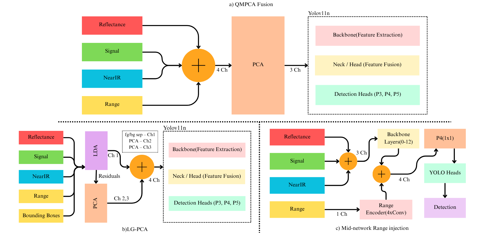

# Beyond Three Channels: Principled Range Integration for LiDAR-Based Snow-Pole Detection

[](https://opensource.org/licenses/MIT)
[](https://www.python.org/)
[](https://pytorch.org/)

**Authors:** Surbhi Tiwari<sup>∗¶</sup>, Alakhsimar Singh<sup>†¶</sup>, Muhammad Ibne Rafiq<sup>‡</sup>, Stefan Seipel<sup>§</sup>, Durga Prasad Bavirisetti<sup>§∥</sup>

*<sup>∗</sup>Dept. of Electronics & Communication Engineering, NIT Jalandhar, India*  
*<sup>†</sup>Dept. of Computer Science & Engineering, NIT Jalandhar, India*  
*<sup>‡</sup>Dept. of Mathematics & Computer Science, Eindhoven University of Technology, Netherlands*  
*<sup>§</sup>Dept. of Computer & Geospatial Sciences, University of Gävle, Sweden*  
*<sup>¶</sup>Equal contribution. <sup>∥</sup>Corresponding: durga.prasad.bavirisetti@hig.se*

## 📋 Table of Contents

- [Overview](#overview)
- [Architecture](#architecture)
- [Repository Structure](#repository-structure)
- [Installation](#installation)
- [Usage](#usage)
- [Training Details](#training-details)
- [Dataset](#dataset)
- [References](#references)
- [Citation](#citation)
- [License](#license)

## 🎯 Overview

This repository implements three principled approaches for integrating range information into LiDAR-based snow-pole detection systems, going beyond traditional 3-channel RGB fusion methods. The work addresses the challenge of effectively utilizing all four co-registered LiDAR modalities: reflectivity, signal strength, near-infrared (NearIR), and range.

### Key Contributions

- **QM-PCA**: Quad-modal PCA fusion that preserves inter-modality correlations
- **FB-PCA**: Foreground-biased PCA that focuses on pole-discriminative features
- **Mid-Network Range Injection**: Architectural fusion at the feature level

All implementations are built on YOLOv11n architecture and evaluated on the SnowPole detection dataset collected in Nordic winter conditions.

## 🏗️ Architecture

### Fig. 1. Overview of the three proposed range-inclusive fusion strategies.



**(a) QM-PCA**: All four modality channels (Reflectance, Signal, NearIR, Range) are concatenated into a 4-channel stack and projected to 3 channels via PCA before entering the YOLOv11n backbone.

**(b) FB-PCA**: Bounding-box annotations supervise an LDA step that produces a foreground/background-separating first channel (Ch 1); the LDA-orthogonal residual is then compressed by PCA into channels 2 and 3. The three channels are concatenated and fed to YOLOv11n.

**(c) Mid-Network Range Injection**: Reflectance, Signal, and NearIR are combined into a 3-channel image and processed by the YOLOv11n backbone (layers 0–12). In parallel, the Range channel is encoded by a 4-layer convolutional Range Encoder (1 Ch) and injected at the P4 neck via concatenation and a 1×1 projection, after which the fused 4-channel feature map is passed to the YOLO detection heads. Here, Ch denotes channel.


## 📁 Repository Structure

```
snowpole-detection/
├── 📓 *.ipynb                    # Ablation study notebooks
├── 🗂️ qm_pca/                     # Quad Modal PCA implementation
├── 🗂️ fbpca_analysis/             # Foreground-Biased PCA implementation
├── 🗂️ lda_pca_fusion/             # LDA + PCA fusion implementation
├── 🗂️ mid_network_range_injection/ # Mid-network injection implementation
├── 🗂️ patches/                    # Ultralytics modification patches
├── 🗂️ scripts/                     # Setup and utility scripts
├── 📄 main.py                     # Unified CLI interface
├── 📄 requirements.txt            # Python dependencies
├── 📄 PATCH.md                    # Technical modification details
└── 📄 README.md                   # This file
```

### Notebook Descriptions

All `.ipynb` files in the root directory are designed for ablation studies and contain:

- **Data exploration and preprocessing**
- **Hyperparameter tuning experiments**
- **Architecture ablation studies**
- **Performance comparison across modalities**

## 🚀 Installation

### Prerequisites

- Python 3.8+
- PyTorch 2.0+
- CUDA-compatible GPU (recommended)

### Setup

1. **Clone the repository**
   ```bash
   git clone https://github.com/AlakhsimarSingh/RangeModalitiesProject.git
   cd RangeModalitiesProject
   ```

2. **Install dependencies**
   ```bash
   pip install -r requirements.txt
   ```

3. **Apply 4-channel ultralytics modifications**
   ```bash
   pip install ultralytics==8.4.6
   python scripts/setup_4ch_ultralytics.py
   ```

4. **Download dataset**
   ```bash
   # Follow instructions from [1] and [2] in References
   ```

## 💻 Usage

### Unified CLI Interface

The repository provides a unified command-line interface for all fusion methods:

```bash
# Quad Modal PCA
python main.py qm-pca pca-run --root "path/to/dataset" --out-root "output/path"

# Foreground-Biased PCA
python main.py fbpca fbpca-run --root "path/to/dataset" --label-root "path/to/labels" --out-root "output/path"

# LDA + PCA Fusion
python main.py lda-pca lda-pca-run --root "path/to/dataset" --label-root "path/to/labels" --out-root "output/path"

# Mid-Network Range Injection Training
python main.py mid-network train --data-yaml "config.yaml" --model-yaml "model.yaml" --range-train-dir "range/train"
```

### Python API

```python
from qm_pca import QMPCAConfig, run_pca_pipeline
from fbpca_analysis import FBPCAConfig, run_fbpca_pipeline
from lda_pca_fusion import LDAPCAConfig, run_lda_pca_pipeline

# Example: QM-PCA fusion
config = QMPCAConfig(
    root=Path("path/to/dataset"),
    out_root=Path("output/path"),
    modalities=["reflec", "signal", "nearir", "range"]
)
pca_model = run_pca_pipeline(config)
```

## 🏋️ Training Details

All models were trained for up to 500 epochs with early stopping (patience = 80) using:

- **Optimizer**: AdamW
- **Batch Size**: 8
- **Input Resolution**: 1024 × 1024
- **Data Augmentation**: Mosaic/mixup disabled to preserve LiDAR projection statistics
- **Precision**: Automatic Mixed-Precision (AMP) disabled for numerical stability
- **Hardware**: NVIDIA RTX 5050 Laptop GPU (8 GB VRAM)

### Example Training Command

```bash
python main.py qm-pca pca-train \
    --data-yaml "qm_pca_config.yaml" \
    --model-yaml "yolo11n.yaml" \
    --project "qm_pca_experiment" \
    --name "qm_pca_yolo11n" \
    --imgsz 1024 \
    --epochs 500 \
    --patience 80 \
    --batch 8 \
    --device 0
```

## 📊 Dataset

We use the snow-pole detection dataset introduced in [1] and made publicly available in [2]. The dataset was collected using a Velodyne LiDAR sensor in Nordic winter conditions and provides four co-registered range-image modalities per scene: reflectivity, signal strength, near-infrared (NearIR), and range.

**Dataset Statistics:**
- **Training**: 1,367 images
- **Validation**: 390 images
- **Test**: 197 images
- **Object Class**: Single class (snowpole)
- **Annotation Format**: YOLO format axis-aligned bounding boxes

### Data Configuration

Example `data.yaml` for 4-channel training:
```yaml
path: ./dataset
train: images/train
val: images/valid
test: images/test
nc: 1
names: ["snowpole"]
channels: 4  # Enable 4-channel input
```

## 📚 References

### Primary Dataset and Related Work

[1] D. P. Bavirisetti et al., "SnowPole detection: A comprehensive dataset for detection and localization using LiDAR imaging in Nordic winter conditions," *Data in Brief*, vol. 59, p. 111403, 2025.

[2] D. P. Bavirisetti et al., "SnowPole detection dataset V2–V3," *Mendeley Data*, 2024.

### YOLO and Object Detection

[3] J. Redmon, S. Divvala, R. Girshick, and A. Farhadi, "You Only Look Once: Unified, Real-Time Object Detection," in *Proceedings of the IEEE Conference on Computer Vision and Pattern Recognition (CVPR)*, 2016, pp. 779–788.

[4] A. Bochkovskiy, C.-Y. Wang, and H.-Y. M. Liao, "YOLOv4: Optimal Speed and Accuracy of Object Detection," *arXiv preprint arXiv:2004.10934*, 2020.

[5] Ultralytics YOLOv8 Documentation. Available: https://docs.ultralytics.com/

[6] C.-Y. Wang, A. Bochkovskiy, and H.-Y. M. Liao, "YOLOv11: A New State-of-the-Art YOLO Model," *arXiv preprint arXiv:*, 2024.

### LiDAR and Multi-Modal Fusion

[7] I. Goodfellow, Y. Bengio, and A. Courville, *Deep Learning*. MIT Press, 2016.

[8] S. Ren, K. He, R. Girshick, and J. Sun, "Faster R-Region Convolutional Neural Networks: Towards Real-Time Object Detection with Region Proposal Networks," *IEEE Transactions on Pattern Analysis and Machine Intelligence*, vol. 39, no. 6, pp. 1137–1149, 2017.

[9] K. He, X. Zhang, S. Ren, and J. Sun, "Deep Residual Learning for Image Recognition," in *Proceedings of the IEEE Conference on Computer Vision and Pattern Recognition (CVPR)*, 2016, pp. 770–778.

### Dimensionality Reduction and Feature Fusion

[10] I. T. Jolliffe, *Principal Component Analysis*. Springer, 2002.

[11] R. A. Fisher, "The Use of Multiple Measurements in Taxonomic Problems," *Annals of Eugenics*, vol. 7, no. 2, pp. 179–188, 1936.

[12] A. M. Martinez and A. C. Kak, "PCA versus LDA," *IEEE Transactions on Pattern Analysis and Machine Intelligence*, vol. 23, no. 2, pp. 228–233, 2001.

### Computer Vision Libraries

[13] OpenCV Library. Available: https://opencv.org/

[14] PyTorch: An Imperative Style, High-Performance Deep Learning Library. Available: https://pytorch.org/

[15] scikit-learn: Machine Learning in Python. Available: https://scikit-learn.org/

## 📖 Citation

If you use this work in your research, please cite:

```bibtex
@article{tiwari2026beyond,
  title={Beyond Three Channels: Principled Range Integration for LiDAR-Based Snow-Pole Detection},
  author={Tiwari, Surbhi and Singh, Alakhsimar and Rafiq, Muhammed Bin and Seipel, Stefan and Bavirisetti, Durga Prasad},
  journal={arXiv preprint arXiv:XXXX.XXXXX},
  year={2026}
}

```

## 📄 License

This project is licensed under the MIT License - see the [LICENSE](LICENSE) file for details.

```
MIT License

Copyright (c) 2026 Surbhi Tiwari, Alakhsimar Singh, Muhammed Bin Rafiq, Stefan Seipel, Durga Prasad Bavirisetti

Permission is hereby granted, free of charge, to any person obtaining a copy
of this software and associated documentation files (the "Software"), to deal
in the Software without restriction, including without limitation the rights
to use, copy, modify, merge, publish, distribute, sublicense, and/or sell
copies of the Software, and to permit persons to whom the Software is
furnished to do so, subject to the following conditions:

The above copyright notice and this permission notice shall be included in all
copies or substantial portions of the Software.

THE SOFTWARE IS PROVIDED "AS IS", WITHOUT WARRANTY OF ANY KIND, EXPRESS OR
IMPLIED, INCLUDING BUT NOT LIMITED TO THE WARRANTIES OF MERCHANTABILITY,
FITNESS FOR A PARTICULAR PURPOSE AND NONINFRINGEMENT. IN NO EVENT SHALL THE
AUTHORS OR COPYRIGHT HOLDERS BE LIABLE FOR ANY CLAIM, DAMAGES OR OTHER
LIABILITY, WHETHER IN AN ACTION OF CONTRACT, TORT OR OTHERWISE, ARISING FROM,
OUT OF OR IN CONNECTION WITH THE SOFTWARE OR THE USE OR OTHER DEALINGS IN THE
SOFTWARE.
```

## 🤝 Contributing

Contributions are welcome! Please feel free to submit a Pull Request.

### Development Setup

1. Fork the repository
2. Create a feature branch
3. Make your changes
4. Run tests
5. Submit a pull request

### Code Style

- Follow PEP 8 guidelines
- Use type hints for function signatures
- Include docstrings for all functions and classes
- Add unit tests for new functionality

## 🙏 Acknowledgments

This work was supported by the Knowledge Foundation (KKS), Sweden (Contract No. KKS-20230085) under the project "Digital Image Analysis and Artificial Intelligence". The authors acknowledge the Norwegian Research Council project "Machine Sensible Infrastructure under Nordic Conditions" (Project No. 333875) for publicly available resources. Thanks to Frank Lindseth and Gabriel Hanssen Kiss of NTNU for support during postdoctoral research, particularly in vehicle setup, data collection, and technical discussions.


---

**Note**: This repository contains research code for ablation studies. For production use, consider the modular implementations in the respective package directories (`qm_pca/`, `fbpca_analysis/`, `lda_pca_fusion/`, `mid_network_range_injection/`).
